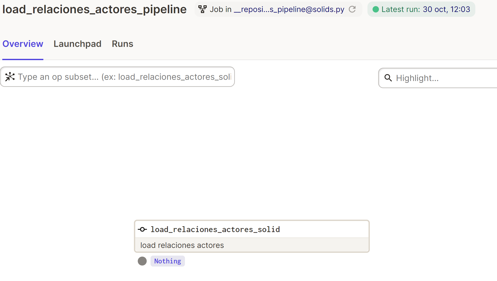
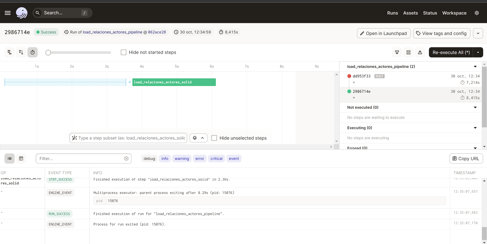
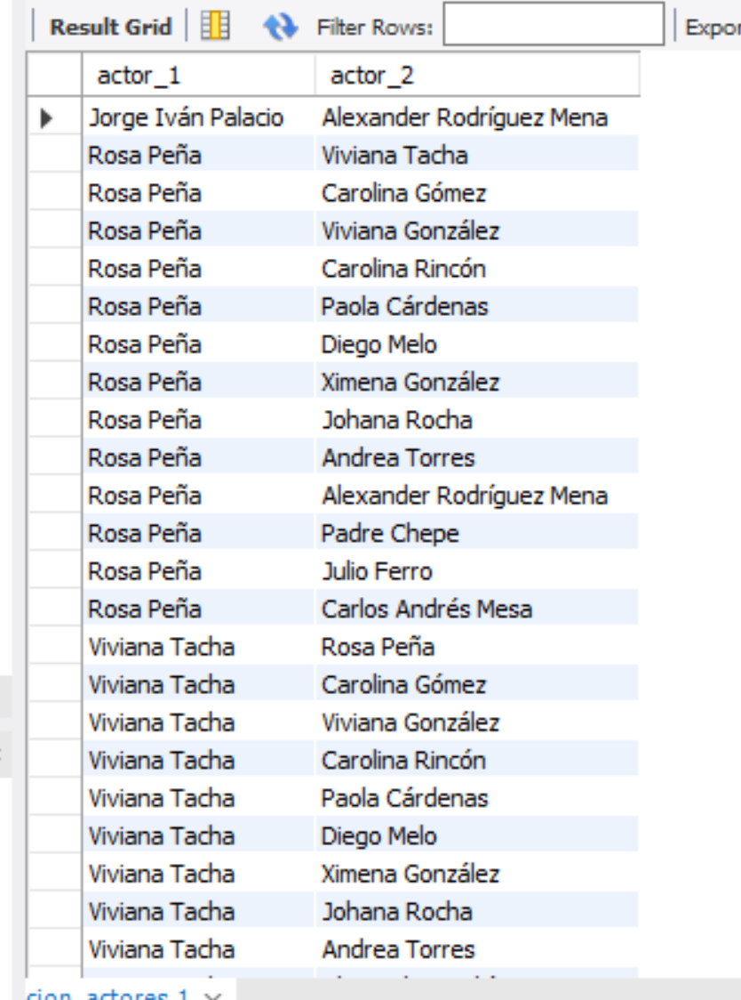

---
title: "Prueba Técnica"
autor: "Carlos Hernandez Martinez"

# Reporte PT
## Creación de la base de Datos
Para este ejemplo se utilizó docker para iniciar una base de datos mysql 
```
version: '3.3'
services:
  db:
    image: mysql:5.7
    restart: always
    environment:
      MYSQL_DATABASE: 'db_pt'
      # So you don't have to use root, but you can if you like
      MYSQL_USER: 'u_pt'
      # You can use whatever password you like
      MYSQL_PASSWORD: 'H4rnand4z#'
      # Password for root access
      MYSQL_ROOT_PASSWORD: 'H4rnand4z#'
    ports:
      # <Port exposed> : < MySQL Port running inside container>
      - '3306:3306'
    expose:
      # Opens port 3306 on the container
      - '3306'
      # Where our data will be persisted
    volumes:
      - /home/docker:/var/lib/mysql
# Names our volume
volumes:
  my-db:
``` 

Creacion de la tabla destino
``` sql
USE db_pt

CREATE TABLE relacion_actores (
	id int,
	actor_1 varchar(50),
	actor_2 varchar(50),
	primary key(id)
)
```

## Resolución 
Estructura de archivos
```
prueba_tecnica
│   └───etl_ralaciones_actores
│   │   │   └───config_jobs
│   │   │       │   shedule.py
│   │   │       │   solids.py
│   │   load_relacion_actores.py
│   |   Matriz_de_adyacencia_data_team.xlsx
│   │   read_credentials.py
│   .env
│   .markdown
│   docker-compose.yml
```
Se crea pipeline para que dagster lo ejecute 11 PM de cada dia, por lo que se configura el schedule.py
```py
from dagster import schedule
from datetime import datetime, time, date

@schedule(
	cron_schedule= "0 23 * * *",
	pipeline_name= "etl_relaciones_actores_schedule",
	execution_timezone="US/Central"
)

def etl_relaciones_actores_schedule(context):
    date = context.scheduled_execution_time.strftime("%Y-%m-%d")
    return {
        "solids": {
            "load_relaciones_actores_solid": {"config": {"date": date}},

        }
    }   
```
Se configura el archivo solids.py para que dagaster orqueste los steps para el proceso etl_relaciones_actores
```py
from etl_relaciones_actores.load_relacion_actores import *
from dagster import op, job, Nothing

@op(description="load relaciones actores")
def load_relaciones_actores_solid () -> Nothing:
    load_relaciones_actores()

@job()
def load_relaciones_actores_pipeline():
    load_relaciones_actores_solid()
```
##### Se crea el archivo load_relacion_actores.py en cual se crearon las funciones para la extraccion, transformacion y carga de los datos

Funcion de extracción
```py
def extraer_datos_excel():
    print(":::::::::::::::::::::::::")
    print("Inicia extraccion")
    source_file_name = os.getcwd()
    filename = "Matriz_de_adyacencia_data_team.xlsx"
    path_attch = os.path.join(source_file_name, 'etl_relaciones_actores', filename)
    xls = pd.ExcelFile(f"{path_attch}")
    print(":::::::::::::::::::::::::")
    print("Extraccion completada")
    return xls
```
Para la lectura de los datos en excel y la munipulacion de los mismos se utliza Pandas
* **pd.ExcelFile**: Es una clase que nos permite leer los datos de un archivo excel y tranformarlo en un DataFrame

Función de Extracción
```py
def transform_datos_excel(xls):
    print(":::::::::::::::::::::::::")
    print("Inicia transformación")
    df = pd.read_excel(xls, 'Matriz de adyacencia')
    df_list_actores = pd.read_excel(xls, 'Lista de actores')
    df_list_actores.drop([0], inplace=True)
    df_list_actores.drop([1], inplace=True)
    df_list_actores.drop([2], inplace=True)
    df_list_actores = df_list_actores['Unnamed: 2'] 
    df_relacion_actores = pd.DataFrame(columns=[])
    list_actores = df_list_actores.values.tolist()
    df.pop('Unnamed: 0')
    df.pop('Unnamed: 1')
    df.drop([0], inplace=True)
    df.reset_index(drop=True, inplace=True)
    list_head = list(df.columns)
    df.set_axis(list_head, axis=1, inplace=True)
    for col in  df.columns:
        for index, row in df.iterrows():
            if df[col][index] == 1 :
                new_row = {'actor_1':list_actores[col-1], 'actor_2':list_actores[index]}
                df_relacion_actores = df_relacion_actores.append(new_row, ignore_index=True)
    print(":::::::::::::::::::::::::")
    print("Transformación completada")
    return df_relacion_actores
```
* **pd.read_excel**: En este caso lo utilizamos para acceder a las pestañas contenidas en **xls**
* **df_list_actores.drop**: Con esta función eliminamos las filas que no se ocuparan y tener solo los datos necesarios
* **df_list_actores['Unnamed: 2']**: Crea un dataframe con solo las columna que contiene los nombres de los actores
* **pd.DataFrame(columns=[])**: Creamos un df vacio
* **df_list_actores.values.tolist()**: Creamos un lista de actores a partir de una columna del df
* **df.pop**: Eliminas columnas que se ocuparan y tener solo los datos necesarios
* **df.reset_index**: Reseteamos el index, para que inicie el df en valor 0
* **df.set_axis**: Agregamos los headers del df a partir de una lista
* **for col in  df.columns**: Creamos un ciclo for para recorrer el df a partir de columnas
* **df.iterrows()**: Nos genera un objeto iterrador del df
* **for index, row in df.iterrows()**: Creamos un ciclo for para recorrer el df a partir de filas
* **df[col][index] == 1**: Validacion para cuando exita una relacion
* **list_actores[col-1]**: Cuando la valdación se cumple, se obtiene el numero de la columna y se hace una busqueda en la lista a partir de ese numero
* **list_actores[index]**: Cuando la validación se cumple, se obtiene el index de la fila y se hace una busqueda en la lista a partir de ese index
* **df_relacion_actores.append**: Se inserta un nuevo row a el dataframe relacion actores

Funcion de Carga
```py
def load_relaciones_actores():
    df = extraer_datos_excel()
    df_relacion_actores = transform_datos_excel(df)
    print(":::::::::::::::::::::::::")
    print("load_relaciones_actores")
    host_mysql = os.getenv('HOST_MYSQL')
    port_mysql = os.getenv('PORT_MYSQL')
    user_mysql = os.getenv('USER_MYSQL')
    pass_mysql = os.getenv('PASS_MYSQL')
    schema = os.getenv('SCHEMA_MYSQL')
    tabla  = 'relacion_actores'
    engine = create_engine(f'mysql+mysqlconnector://{user_mysql}:%s@{host_mysql}:{port_mysql}/{schema}' % quote(pass_mysql))

    try:
        df_relacion_actores.to_sql(name=tabla, con=engine, if_exists='replace', index=False,chunksize=10000)
    except Exception as e:
        print(e)
    pass
```
* **os.getenv()**: Nos permite leer las variables clave-par-valor en el archivo .env
* **create_engine**: Crea una conexión a la base de datos mysql
* **to_sql**: Escribe los registros almancenados en el df_relacion_actores a la base de datos mysql

# Resultados
## Dagster

## Run Dagster


# Datos Mysql




